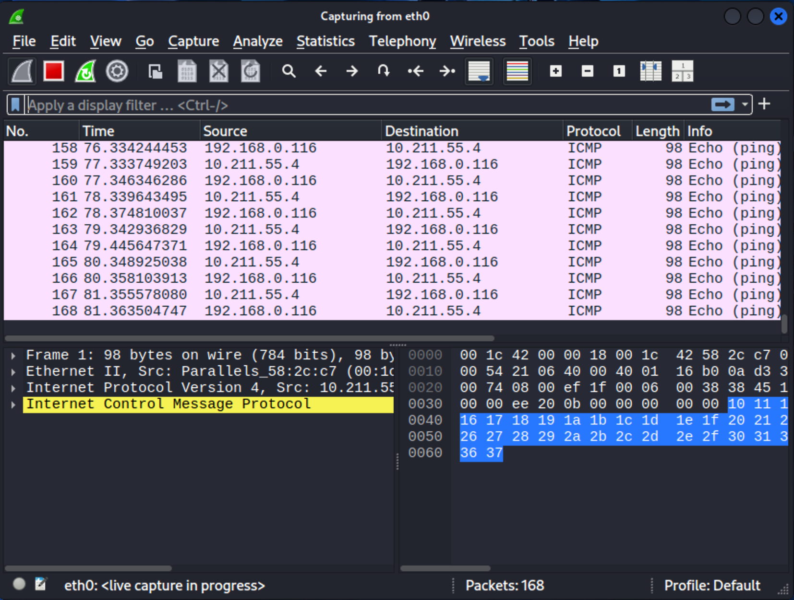
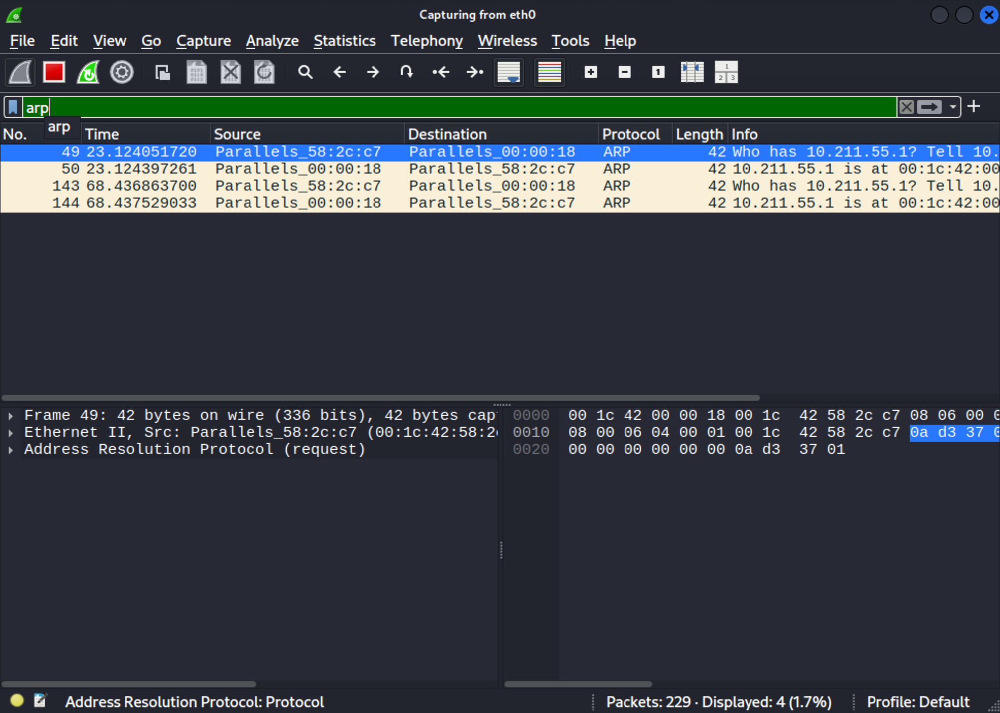
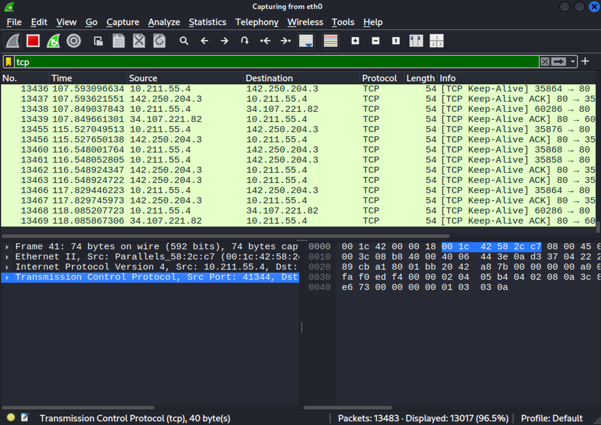
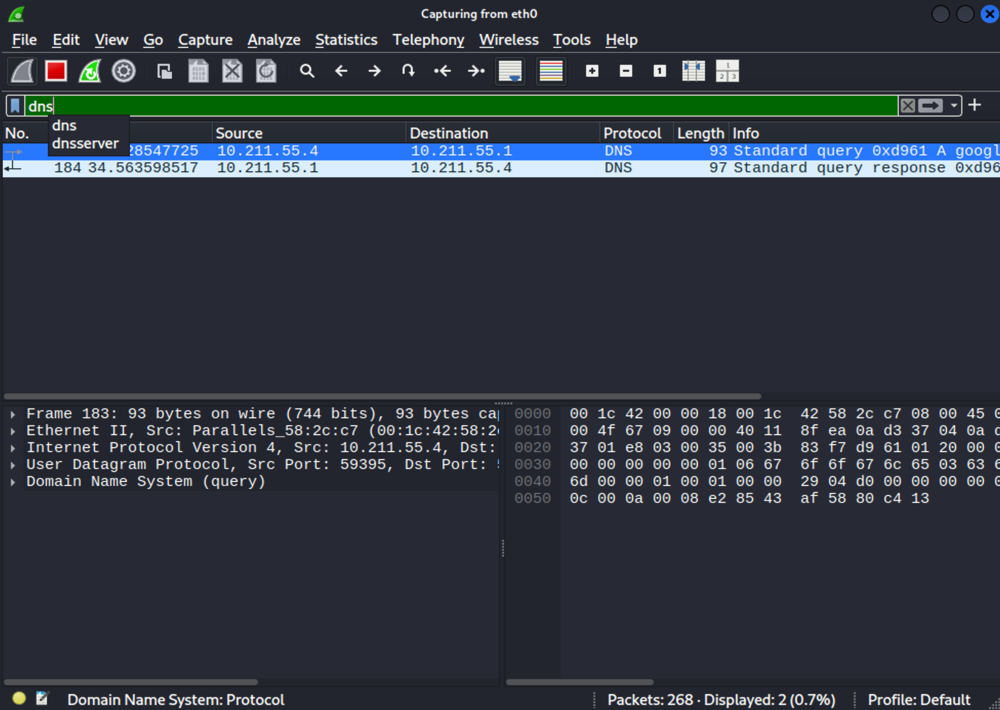

📘 Project 1 – Network Traffic Analysis with Wireshark

Hands on analysis of ICMP, ARP, TCP and DNS using Kali Linux, Windows 11 and Wireshark
Cybersecurity Fundamentals – Networking & Packet Analysis


🎯 Purpose of the Project

This project demonstrates essential entry level cybersecurity skills, including:
	•Practical understanding of networking fundamentals
	•Capturing and analysing packets using Wireshark
	•Identifying core protocols: ICMP, ARP, TCP and DNS
	•Communication across virtualised environments
	•Professional technical documentation

These skills are directly relevant to entry level cyber roles in Australia, including SOC Analyst, Cybersecurity Analyst and IT Security Support.


🖥️ Laboratory Environment

Component	Details
Host 1	MacBook running macOS
VM 1 (primary)	Kali Linux on Parallels Desktop
Host 2	Windows laptop
VM 2 (target)	Windows 11 on Oracle VirtualBox
Packet capture tool	Wireshark (Kali)
Network mode	Bridged / local network


🔧 Tools Used
	•	Wireshark
	•	ping, arp, nslookup / dig
	•	Firefox (to generate TCP traffic)
	•	Kali Terminal & Windows CMD


📡 Activities Performed


1️⃣ ICMP – Ping from Kali to Windows 11

Description

Captured ICMP packets (echo request and echo reply) to validate host to host communication.



Key Observations
	•Successful bi directional communication between Kali and Windows
	•ICMP type 8 (echo request) and type 0 (echo reply) identified
	•Source and destination clearly showing the traffic flow


2️⃣ ARP – Address Resolution on the Local Network

Description

Captured ARP traffic used to resolve MAC addresses in the local network.



Key Observations
	•“Who has…? Tell…” ARP broadcast messages
	•ARP Request and ARP Reply
	•Essential layer 2 protocol enabling communication on the LAN


3️⃣ TCP – Browser Traffic (3 Way Handshake + Data)

Description

Captured TCP traffic by browsing a website using Firefox on Kali.



Key Observations
	•3 way handshake observed: SYN → SYN/ACK → ACK
	•Connection establishment and data flow
	•Keep Alive packets present
	•Typical HTTP/HTTPS traffic identified


4️⃣ DNS – Domain Name Resolution

Description

Captured DNS queries and responses using dig / nslookup.



Key Observations
	•DNS A record query (google.com)
	•Response containing resolved IPv4 addresses
	•UDP port 53 communication
	•Demonstrates real world name resolution workflow


📂 Project Structure

```
project1-wireshark/
├── README.md
└── screenshots/
    ├── icmp.png
    ├── arp.png
    ├── tcp.png
    └── dns.png
```


💡 Skills Demonstrated

✔ Networking fundamentals
✔ Packet capture and analysis
✔ Wireshark proficiency
✔ Understanding of ICMP, ARP, TCP and DNS
✔ Troubleshooting network communication
✔ Virtual lab setup and configuration
✔ Documentation and reporting


📌 Conclusion

This project validates core cybersecurity skills through hands on analysis of network traffic.
Using a fully virtualised lab, various essential network protocols were captured, inspected and documented.
These foundations are crucial for Security Operations Centre (SOC) roles, incident analysis and general cybersecurity work in Australia.


🏷️ Tags

cybersecurity networking wireshark packet-analysis kali-linux tcp icmp dns arp entry-level australia
